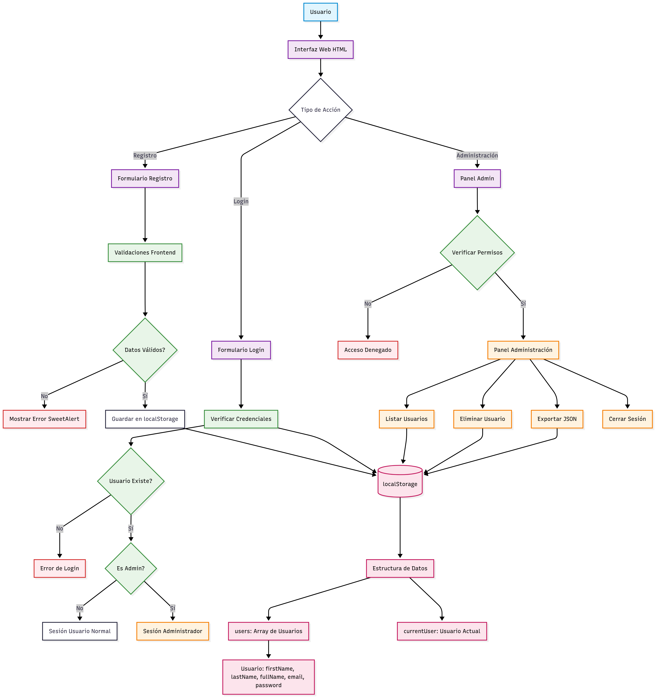

# Sistema de Gestión de Usuarios

Este proyecto es una aplicación web sencilla para la gestión de usuarios, desarrollada con **HTML**, **CSS** (personalizado y Bootstrap), y **JavaScript** puro. Permite el registro, inicio de sesión y administración de usuarios, incluyendo la descarga de la base de datos en formato JSON y la eliminación de usuarios. Incluye un panel especial para el administrador.

---

## Características principales

- **Registro de usuarios:**  
  Los usuarios pueden crear una cuenta proporcionando nombre, apellidos, correo y contraseña.  
  La contraseña debe cumplir requisitos de seguridad (mayúscula, número, carácter especial y longitud mínima).

- **Inicio de sesión:**  
  Los usuarios pueden iniciar sesión con su correo y contraseña.

- **Panel de administración:**  
  Solo accesible para el usuario administrador (`admin@admin.com`).  
  Permite ver la lista de usuarios, eliminar usuarios, descargar la base de datos en JSON y cerrar sesión.

- **Persistencia local:**  
  Todos los datos se almacenan en el navegador usando `localStorage`.

- **Validaciones:**  
  Validación de campos, requisitos de contraseña y restricciones de correo (no se permite registrar usuarios con dominio `admin.com`).

- **Interfaz moderna:**  
  Uso de Bootstrap, Bootstrap Icons, SweetAlert2 y estilos personalizados con efectos visuales.

---

## Estructura y arquitectura monolítica cliente

**Patrón Arquitectónico:**

* SPA (Single Page Application) con arquitectura de 3 capas
* Patrón MVC Frontend (Model-View-Controller)

Capas de la Arquitectura

### Capa de Presentación (View)

* HTML5 (Estructura semántica)
* Bootstrap 5 (Framework CSS)
* Bootstrap Icons (Iconografía)
* SweetAlert2 (Notificaciones)
* CSS personalizado (Estilos)

### Capa de Lógica (Controller)

Archivo: `script.js`

* Event Handlers (Eventos DOM)
* Validation Logic (Validaciones)
* Business Rules (Reglas de negocio)
* State Management (Gestión de estado)
* UI Updates (Actualización interfaz)

### Capa de Datos (Model)

Uso de `localStorage`

* `users[]` (Colección usuarios)
* `currentUser{}` (Usuario activo)
* JSON Structure (Estructura de datos)

Patrones de Diseño Implementados

* MVC para separación de responsabilidades
* SPA para carga dinámica
* Uso de patrones modulares en JavaScript

**Flujo Arquitectónico**

**Flujo de Datos Unidireccional:**
Usuario → DOM Events → JavaScript Logic → localStorage → UI Update

**Ciclo de Vida de la Aplicación:**

1. Inicialización: Carga DOM e inicializa localStorage
2. Interacción: Usuario activa eventos
3. Procesamiento: Validación y lógica de negocio
4. Persistencia: Almacenamiento en localStorage
5. Renderización: Actualización de la interfaz

---

### Archivos principales

- **index.html**  
  Estructura principal de la aplicación.  
  Incluye las pestañas de registro, login y administración, así como los enlaces a los recursos externos y archivos locales.

- **index.css**  
  Estilos personalizados para la interfaz, incluyendo fondo animado, tarjetas con efecto vidrio, responsividad y detalles visuales.

- **script.js**  
  Lógica principal de la aplicación.  
  Gestiona el registro, login, validaciones, renderizado del panel de administración, descarga de usuarios y eliminación de usuarios.

### Flujo de la aplicación

1. **Carga inicial:**  
   - Se asegura que exista un usuario administrador en `localStorage`.
   - Si hay una sesión activa de administrador, se muestra el panel de administración.

2. **Registro:**  
   - El usuario llena el formulario de registro.
   - Se validan los campos y la contraseña.
   - Se verifica que el correo no esté registrado ni tenga el dominio `admin.com`.
   - Si todo es correcto, se guarda el usuario en `localStorage`.

3. **Inicio de sesión:**  
   - El usuario ingresa su correo y contraseña.
   - Si es el administrador, se muestra la pestaña de administración.
   - Si es un usuario normal, solo puede acceder a las funciones básicas.

4. **Panel de administración:**  
   - Solo visible para el administrador.
   - Permite ver todos los usuarios, eliminar usuarios, descargar la base de datos y cerrar sesión.

5. **Persistencia:**  
   - Todos los datos se guardan y consultan desde `localStorage`, por lo que la información persiste entre recargas de página.

---

## Requisitos para ejecutar

- Solo necesitas un navegador moderno.
- No requiere servidor ni instalación adicional.
- Abre el archivo `index.html` en tu navegador.

---

## Créditos

- [Bootstrap](https://getbootstrap.com/)
- [Bootstrap Icons](https://icons.getbootstrap.com/)
- [SweetAlert2](https://sweetalert2.github.io/)
- [Google Fonts - Inter](https://fonts.google.com/specimen/Inter)

---

